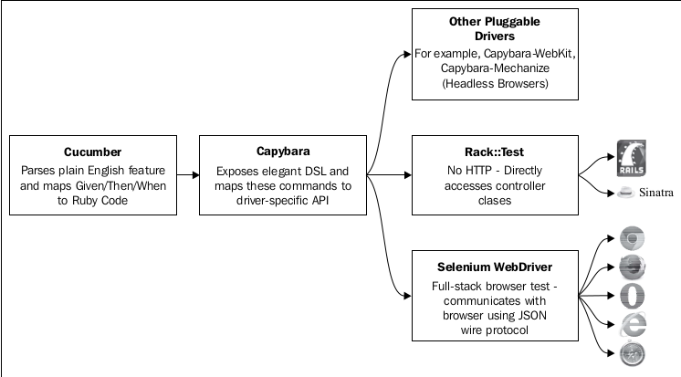

# Swaglabs Automation demo with Cucumber, Capybara and Selenium in Ruby

1. [Introduction](#Introduction)
2. [CheetSheets](#CheetSheets)
3. [Reference](#Reference)

# Introduction

#### Installing Ruby - Ubuntu 18.04

```bash
    # install Ruby
    sudo apt install ruby-full

    # install Bundler
    gen install bundler
```

#### Installing Webdriver

```bash

    # download
    wget https://github.com/mozilla/geckodriver/releases/download/v0.26.0/geckodriver-v0.26.0-linux64.tar.gz

    # exract
    tar -xvzf geckodriver*

    # make it executable
    chmod +x geckodriver

    # move to bin [or]
    sudo mv geckodriver /usr/bin/

    # Add the driver to your PATH so other tools can find it:
    export PATH=$PATH:/path-to-extracted-file/.

```

##### Capybara

Capybara brings two key ingredients to test automation: human-readable code via
an elegant domain-specific language (DSL) and the ability to write once and run
on multiple drivers such as Selenium WebDriver or Rack::Test for Rails/Sinatra
applications

Capybara is simply an API that provides a layer of abstraction on top of your actual automation library. If it helps, think of Capybara as your translator; you tell it to do something and it translates a nice elegant command into the API of your given driver(which can be a lot less friendly).

So to use this translator we need to have both a way of telling it what to do and also an automation library API for it to translate in to.

Capybara is a very flexible library and it used
in a variety of settings; however, by far the most common use case is to employ
Cucumber as the test runner with Capybara driving Selenium WebDriver to carry
out the browser automation.

##### Cucumber

Cucumber allows the execution of behavior-driven development (BDD) scenarios
written in the Gherkin syntax to drive your tests

##### Selenium WebDriver

Selenium WebDriver is a collection of open source APIs which are used to automate the testing of a web applicationS to verify that it works as expected. It supports many browsers such as Firefox, Chrome, IE, and Safari.

###### Example

```ruby
Feature: Search for Videos on YouTube
    Scenario: Search for Videos of Large Rodents
    Given I am on the YouTube home page
    When I search for "capybara"
    Then videos of large rodents are returned
```

When Cucumber is invoked it parses the plain English scenario and using regular expressions it matches each line to an actual line of Ruby code, called a step
definition. We will use Capybara to implement these steps. Capybara will then handle the communication with Selenium WebDriver, which will open the browser
and start automating the scenario.

The following diagram illustrates the flow from Cucumber through to the underlying driver with Capybara sitting in the middle acting as a translator:



# CheetSheets

## Capybara Actions

```ruby
# Anchor
click_link 'Save'

# Button
click_button 'awesome'

# Both Anchor or Button
click_link_or_button 'Save'

# Text (area) field
fill_in 'Name', with: 'Content'

# Checkbox
check 'Content'
uncheck 'Content'

# Radio button
choose 'Content'

# Select option from select tag
select 'Option', from: 'Label'

# File input
attach_file Rails.root.join('spec/fixture/some_file.png')
```

## Capybara Finders

```ruby
page.all(:xpath, '//a')

page.first(:xpath, '//a')

page.find('//textarea[@id="additional_newline"]')

page.find(:xpath, "//input[@id='form_pets_dog']")['checked']
# => true

page.find(:css, '#with_focus_event').trigger(:focus)

page.find(:css,'.wrapper').hover

page.find_field("test_field").value
# => 'blah'

page.find_by_id('red').tag_name
# => 'a'

# finds invisible elements when false
page.find_by_id("hidden_via_ancestor", visible: false)

page.find_button('What an Awesome')[:value]
# => 'awesome'

page.find_link('abo').text
# => 'labore'

page.find_link('other')[:href]
# => '/some_uri'
```

## Capybara Common

```ruby
visit("http://google.com")

page.current_url

# Execute the given script, not returning a result. This is useful for scripts that return
# complex objects, such as jQuery statements. +execute_script+ should be used over
# +evaluate_script+ whenever possible.
#
page.execute_script("$('#change').text('Funky Doodle')")

# Evaluate the given JavaScript and return the result. Be careful when using this with
# scripts that return complex objects, such as jQuery statements. +execute_script+ might
# be a better alternative.
#
page.evaluate_script("1+3")
# => 4

using_wait_time 6 do
  # ... Changed Capybara.default_wait_time in this block scope.
end
```

## Capybara Matchers

```ruby
expect(page).to have_content("Some Content")
expect(page).to have_no_content("Some Content")
admin_section = find("#admin")
expect(admin_section).not_to be_present
expect(page).not_to have_selector("#admin")
expect(page).to have_selector("#profile-photo")
expect(page).not_to have_selector("#admin")

# True if there is a anchor tag with text matching regex
expect(page).to have_xpath("//a")
expect(page).to have_xpath("//a",:href => "google.com")
expect(page).to have_xpath("//a[@href => 'google.com']")
expect(page).to have_xpath("//a[contains(.,'some string')]")
expect(page).to have_xpath("//p//a", :text => /re[dab]i/i, :count => 1)

 # can take both xpath and css as input and can take arguments similar to both have_css and have_xpath
 expect(page).to have_selector(:xpath, "//p/h1")
 expect(page).to have_selector(:css, "p a#post_edit_path")

 expect(page).to have_css("input#post_title")
 expect(page).to have_css("input#post_title", :value => "Capybara cheatsheet")

 # True if there are 3 input tags in response
 expect(page).to have_css("input", :count => 3)

 # True if there or fewer or equal to 3 input tags
 expect(page).to have_css("input", :maximum => 3)

 # True if there are minimum of 3 input tags
 expect(page).to have_css("input", :minimum => 3)

 # True if there 1 to 3 input tags
 expect(page).to have_css("input", :between => 1..3)

 # True if there is a anchor tag with text hello
 expect(page).to have_css("p a", :text => "hello")
 expect(page).to have_css("p a", :text => /[hH]ello(.+)/i)

# For making capybara to take css as default selector
Capybara.default_selector = :css

# checks for the presence of the input tag
expect(page).to have_selector("input")

# checks for input tag with value
expect(page).to have_selector("input", :value =>"Post Title")

expect(page).to have_no_selector("input")

# For making capybara to take css as default selector
Capybara.default_selector = :xpath
# checks for the presence of the input tag
expect(page).to have_selector("//input")

# checks for input tag with value
expect(page).to have_selector("//input", :value =>"Post Title")

# checks for presence of a input field named FirstName in a form
expect(page).to have_field("FirstName")

expect(page).to have_field("FirstName", :value => "Rambo")
expect(page).to have_field("FirstName", :with => "Rambo")

expect(page).to have_link("Foo")
expect(page).to have_link("Foo", :href=>"googl.com")
expect(page).to have_no_link("Foo", :href=>"google.com")
```

# Reference

1. [Hoaigiang Gist](https://gist.github.com/hoaigiang94/fa5833df039a452ff400b44b221aa50d)
2. [Team Capybara](https://github.com/teamcapybara/capybara#table-of-contents)
3. [Cucumber](https://gist.github.com/yuriiik/5728701)
4. [tau-capybara](https://github.com/tjmaher/tau-capybara)
